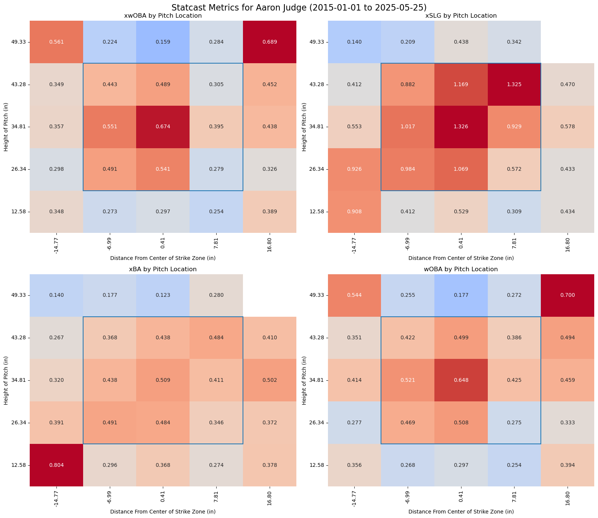
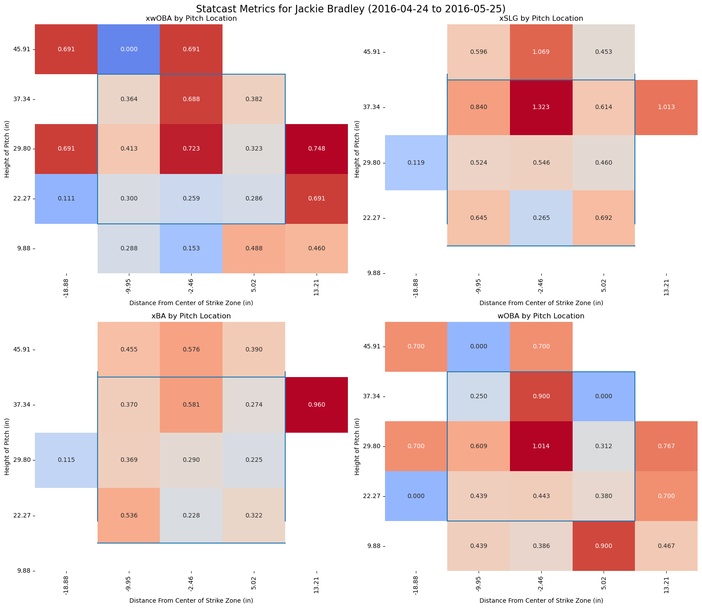
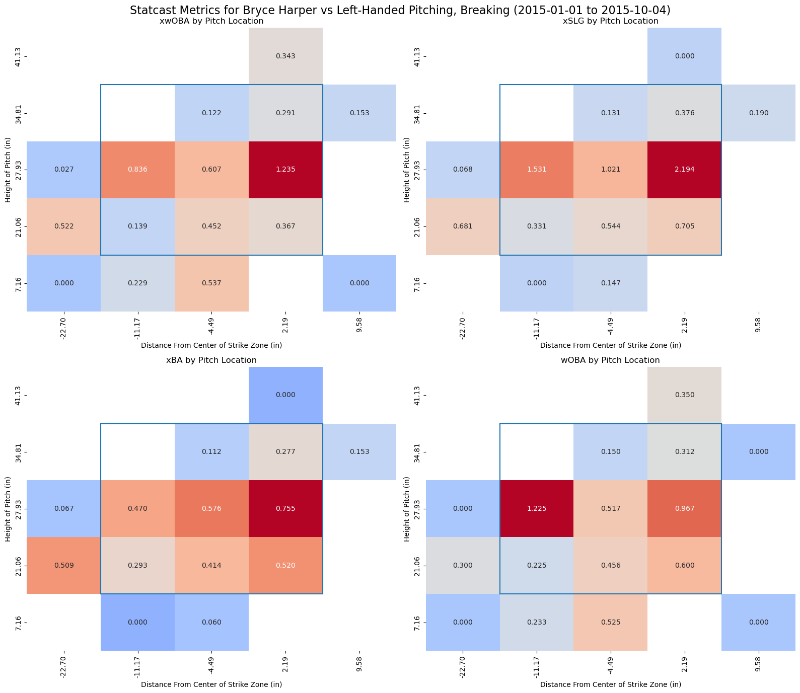

# A script built on top of pybaseball's Statcast scripts to plot a MLB Gameday-style strike zone heatmap.

This is a plotting script meant to be used with pybaseball to get color-coded strike zone heatmaps for individual players by pitch location.  Currently, the function takes five arguments and passes them directly to the statcast call:

```python

def statcast_heatmap(player:  str=None, start_dt = '2015-01-01', end_dt=None, p_throws = None, pitch_type:  str = None):

```

- Player:  The first and last name of a player, as a string i.e. "Rafael Devers"  Currently does not automatically apply accent marks to names which contain them, this will be added.  May not give desired result if multiple players who've played since 2015 share a name.

- start_dt:  A string, in 'YYYY-MM-DD' format.  Optional, if left blank will default to 2015-01-01.  Must be 2015 or later, Statcast data isn't available any earlier.

- end_dt:  A string, in 'YYYY-MM-DD' format.  Optional, will get today's date if left blank but may not include it in results, if Statcast hasn't updated yet.

- p_throws:  A string, filters for pitcher handedness.  Takes in 'l' or 'r', or most common aliases.  Optional, can be left blank to include all pitchers

- pitch_type:  a string, takes in one of fastball, breaking, offspeed.  Optional, leaving blank will include all pitches.

The result will be four heatmaps from 

```python
seaborn.heatmap()
```

# Installation and Execution

Clone repository and install dependencies (common libraries and aliases)

```bash
git clone https://github.com/dylansti02/statcast_heatmaps_and_baseball_analysis.git

cd statcast_heatmaps_and_baseball_analysis

pip install -r requirements.txt

```
To actually run the script, use 

```python

import heatmaps
heatmaps.statcast_heatmap

```
It's probably best to enable caching from pybaseball depending on your request size and internet speed, Statcast calls can take a while.

To do this, run

```python
import pybaseball as pb
pb.cache.enable()
```


EXAMPLES:

- Plotting a player's career heatmaps (since 2015, anyway)

```python
heatmaps.statcast_heatmap('Aaron Judge')
```


- Plotting a legendary hitting streak (remember this, Sox fans?)

```python

heatmaps.statcast_heatmap(player="Jackie Bradley", start_dt='2016-04-24', end_dt='2016-05-25'

```


 - Plotting how well a lefty slugger handles lefty breaking balls

 ```python
heatmaps.statcast_heatmap(player='Bryce Harper', start_dt='2015-01-01', end_dt='2015-10-04', p_throws='L', pitch_type='breaking')
 ```
 

 The last piece of this repository is mostly for fun and not always related to this script, but I'll be doing some smaller baseball data analysis projects and storing them here.  They're in the [bonus_analyses](bonus_analyses) folder here.  