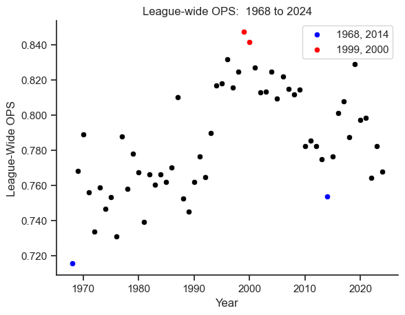
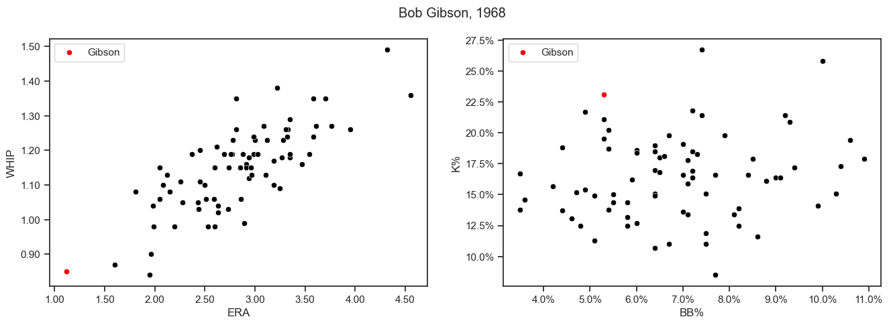
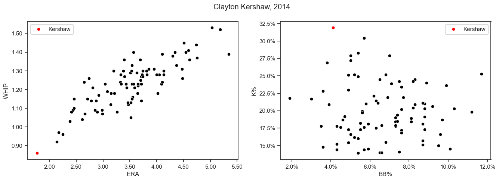
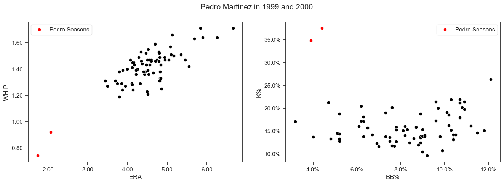
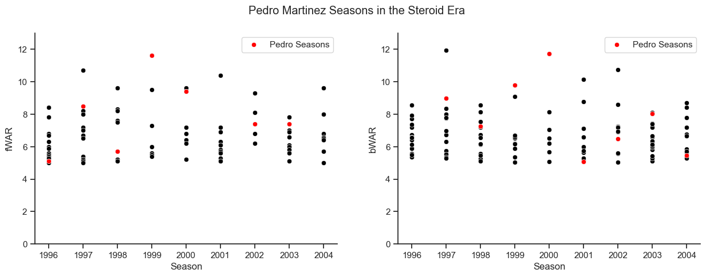

# A non-exhaustive list of the ways Pedro Martinez broke baseball

The code that led to this analysis can be viewed in [this jupyter notebook](pedro_stats.ipynb)

In 1968, the 'Year of the Pitcher,' Bob Gibson recorded a 1.12 ERA.  It's the best a qualified pitcher has ever managed in the live-ball era.  In 2014, Clayton Kershaw put up a 1.77 ERA and won National League MVP despite missing six starts.  In 2022, Justin Verlander returned from Tommy John surgery at age 39 to produce a 1.75 ERA and a 0.829 WHIP.

You might make the case that any of those, or a half-dozen others, was the best season ever pitched.  Or you could give one of my favorite answers:  Pedro Martinez in 1999, or Pedro Martinez in 2000.

These numbers aren't new.  This is far from an original idea.  But to gain some experience using python to plot data, I thought I'd take my own look into the best peak a pitcher ever had.  Using matplotlib and seaborn, I produced several charts that show how elite Pedro was at his peak.  In several of them, I use code to highlight his entries on a scatter plot.  I could have spotted them without highlighting.  You'll see.

### The Run Environment

Pedro's best seasons came in the heart of baseball's steroid era.  In this time, offense exploded and many of baseball's most famous offensive records were pursued or broken.  Plotting league-wide OPS by year shows this run environment nicely:

Not only was Pedro doing this at the peak of the steroid era, he did it in the American League and had to face DHs every night.  

Of course, we wouldn't want to take anything away from Kershaw and Gibson, but there is a difference between being great in their eras and being great in 1999 and 2000.  Gibson's season is called the 'Year of the Pitcher' even today, and Kershaw's 2014 was a strange outlier for low offense compared to the seasons around it.  No wonder the World Series teams were so pitching and defense-focused that year.  

### The Charts

These charts sort of illustrate my point; would you have spotted Kershaw or Gibson on both charts without them being labeled?  Maybe on the ERA-WHIP plot, but on both?  Nobody else in the American League was within a run of Pedro.

### Some extras

- Baseball Reference's bWAR and FanGraphs's fWAR disagree on which of Pedro Martinez's peak seasons was better.  FanGraphs prefers 1999 where he put up an outrageous 1.39 FIP, Baseball Reference prefers 2000 where he put up an even wilder 0.737 WHIP.  
- That 1.39 FIP from 1999 is the best qualified FIP of the live-ball era (Second place is 2021 Corbin Burnes, with 1.63)
- His 0.737 WHIP from 2000 is, without further caveats, the best qualified WHIP in AL/NL history (George Walker produced 0.735 in 1940 for the Kansas City Monarchs)
- A Red Sox pitcher holds the single season WHIP record for relievers, too (Koji Uehara's 2013, 0.57)

By both WAR metrics, here's Pedro Martinez's complete body of work throughout the steroid era, which encompassed most of his prime:
