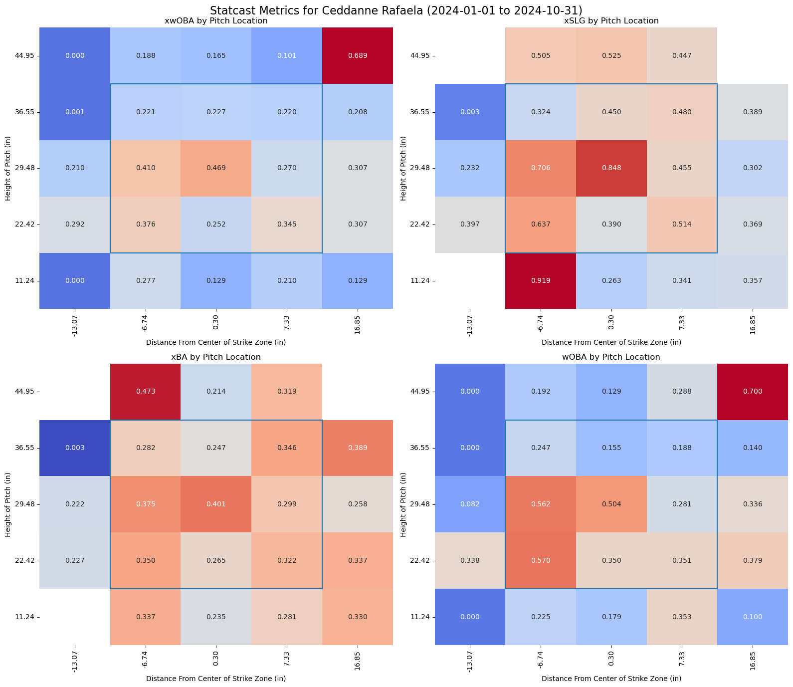
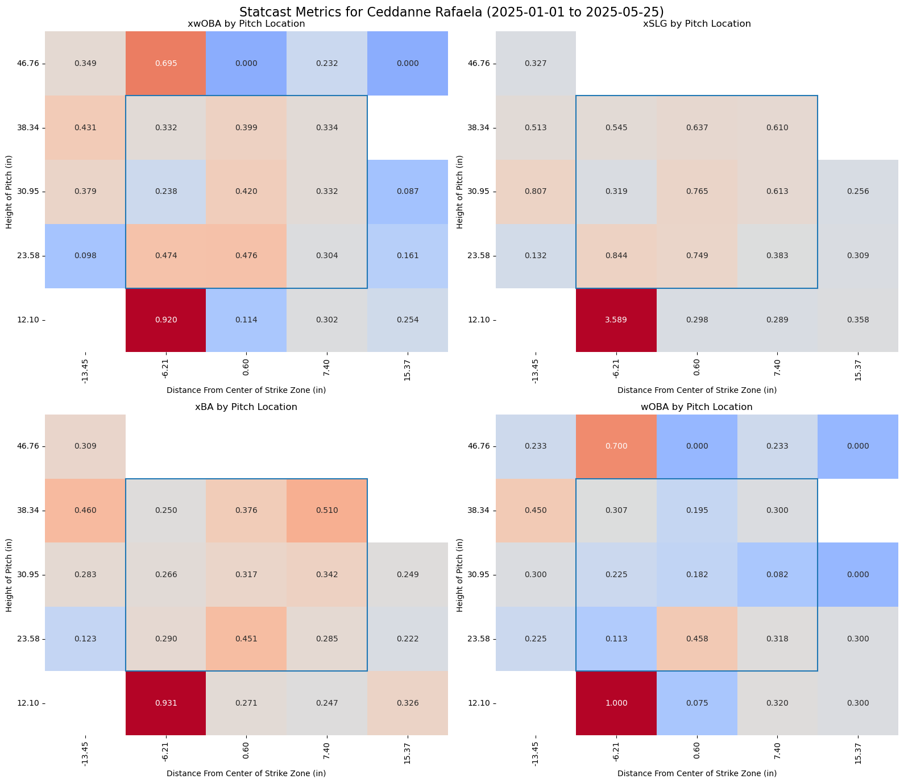
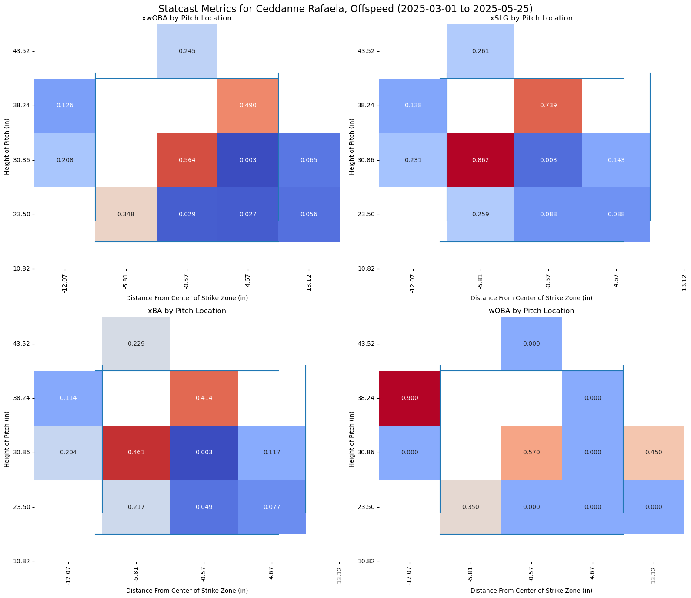
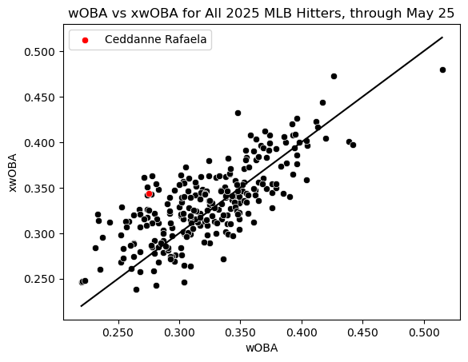
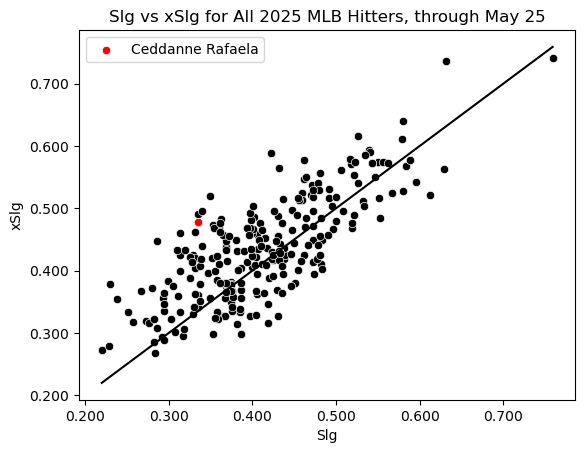

# What's up with Ceddanne Rafaela and Expected Stats?

The code that led to this analysis can be viewed in [this jupyter notebook](rafaela_xstats.ipynb)

Ceddanne Rafaela has become somewhat divisive among Red Sox fans.  Some think his approach is so poor that he can never be a good hitter, and therefore shoudn't be on the field.  Others think his glove is so good that he can never be a bad player, and needs to start in center field.  So, which is it?

Well, he's clearly an elite center fielder.  Already through May 24, he's reached +7 Outs Above Average via statcast.  And his approach clearly isn't good - he's got a 42.8% chase rate, which places him in the first percentile on Baseball Savant.  He walks rarely, but he doesn't actually strike out that much, at 19.4% on the season.  What has given people hope that better offensive numbers would come is his batted ball data, which was producing top-quartile expected wOBA and slugging until a recent slump.

To better visualize these expected stats, I used my new heatmap plotting function, built with pybaseball's statcast functions.  I plotted Rafaela's strike zones for 2024 and through May 25 of 2025.

### Insights
We can take away a few things from these graphs

1.  Rafaela is an improved hitter overall.  The charts for 2024 weren't all that good, and they don't show you that his chase and strikeout rates was even worse.  Both have improved in 2025, particularly the K rate.

2.  In 2025, a huge gap has formed between his expected wOBA and actual wOBA.  While you can't see it here, the same is true for slugging.  I went digging for how xwOBA is calculated, and while the actual formula is propietary, it calculates expected wOBA based on the outcome distribution of a batted ball with given exit velocity and launch angle.

3.  Nobody can look at a few charts and fix a player, or the Red Sox would have done it.  But based on my quick observations, I can see that his underperformance of his expected stats is particularly large in middle-middle and middle-high pitches.  Those are the strikes that great hitters barrel up.  One possible explanation is that he is getting under these balls too much, hitting high fly balls that outfielders can get under.  
4.  Rafaela seems to have refined his two-strike approach, as his whiff and chase rates do not match his overall K rate at all.  It seems that one of his biggest problems is that he's in two strike counts all the time, and then spends the rest of the at-bat battling.

5.  Finally, he's getting buried by changeups.  Statcast records 'putaway%' as the rate of two strike pitches that result in a strikeout, and he's at 26.5% on those, much higher than his actual K rate.  His xWOBA against them is just .227.  From the given putaway% and the actual number of strikeouts he's had on offspeed pitches, we can infer that he sees them in about half of all two-strike counts.  Though the sample size is only about 100 pitches, Rafaela's heatmaps aginst offspeed are telling.

### The Gap

Ceddanne Rafala, as of May 25, has the tenth-largest underperformance of his xWOBA of all qualified hitters.  Luck can always be a factor, but nobody naturally runs a gap that large.  The likeliest outcome, in my opinion, is that the balls will start to fall in more and he'll be a roughly average hitter.  His BABIP of .287 is lower than he managed last year when his contact quality was much worse, and too low for such a fast player (87th percentile sprint speed via Statcast.)  I tried to investigate whether a batter's spray chart correlated with their underperformance of these metrics, but the results were weak and insignificant.  His "pulled air" percent on Statcast is very low, but it was higher last year when he was a worse hitter.  Nonetheless, here's how he slots in on charts of expected wOBA and slugging versus the results:

All stats used are from Statcast, Fangraphs, or Baseball Reference.  Most were pulled directly with the pybaseball functions.