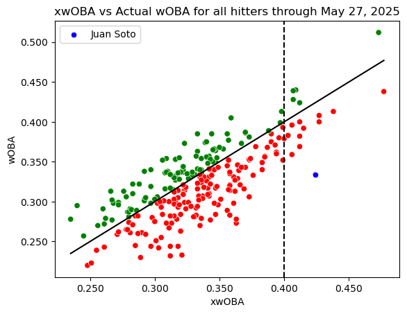
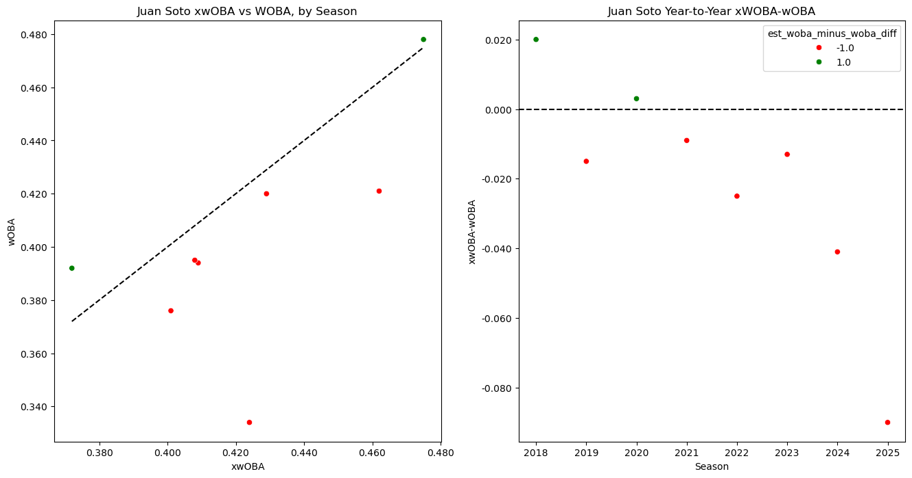
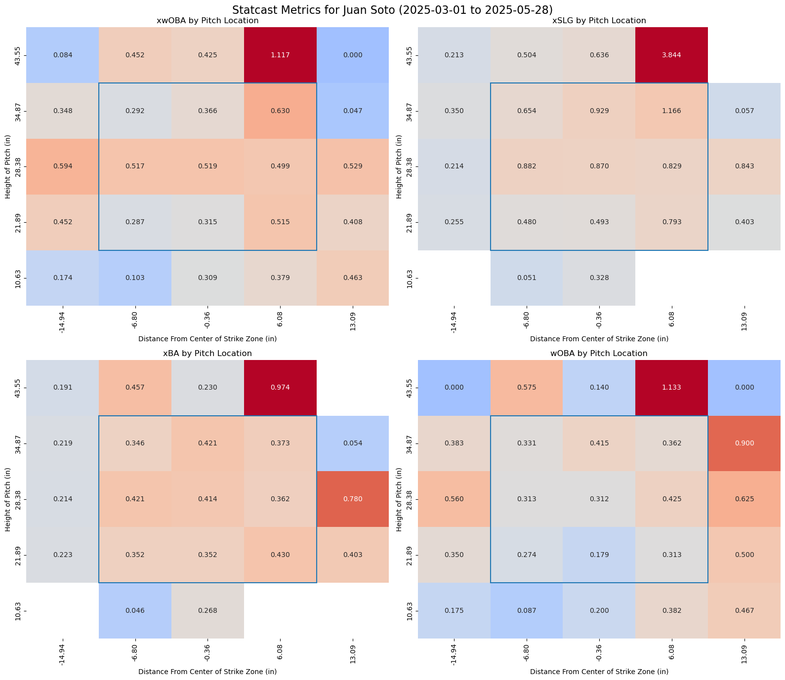
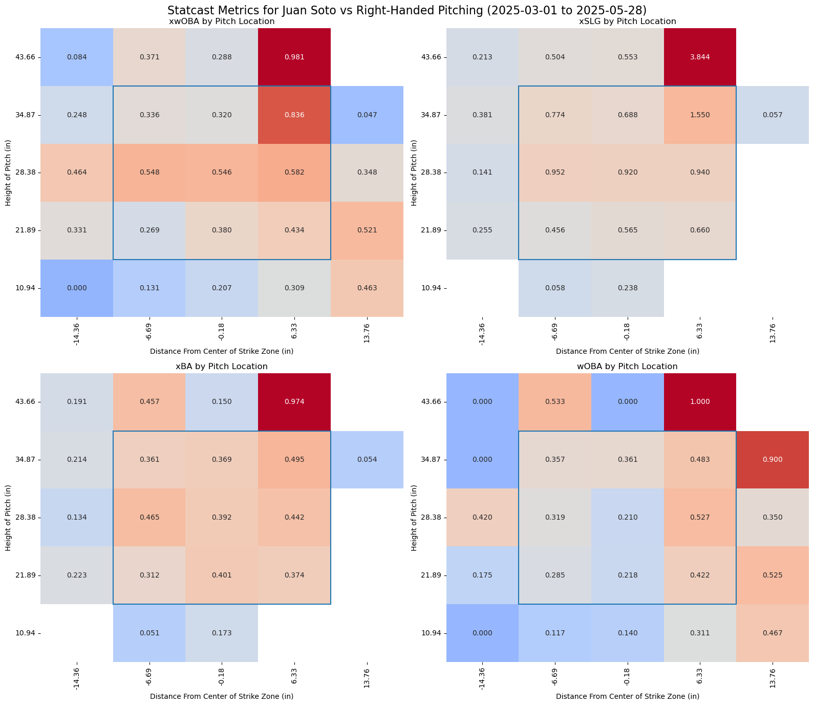
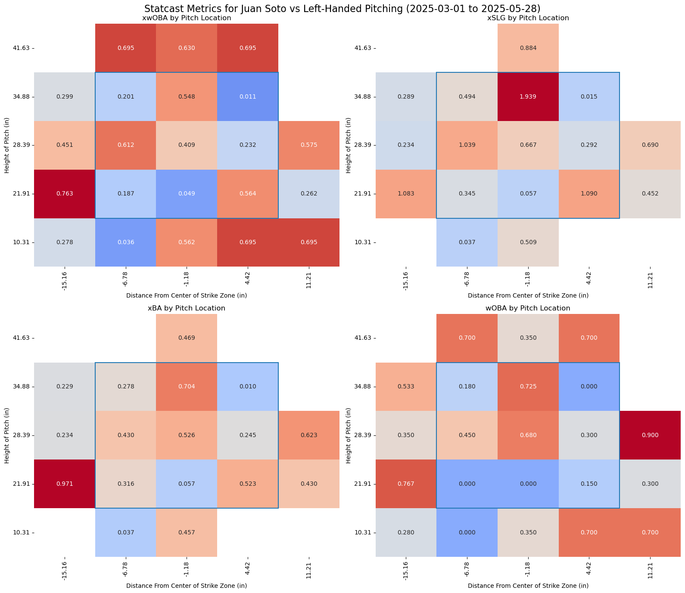
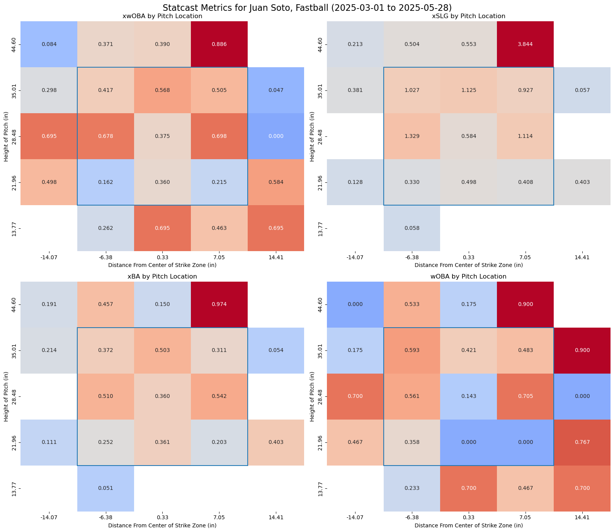
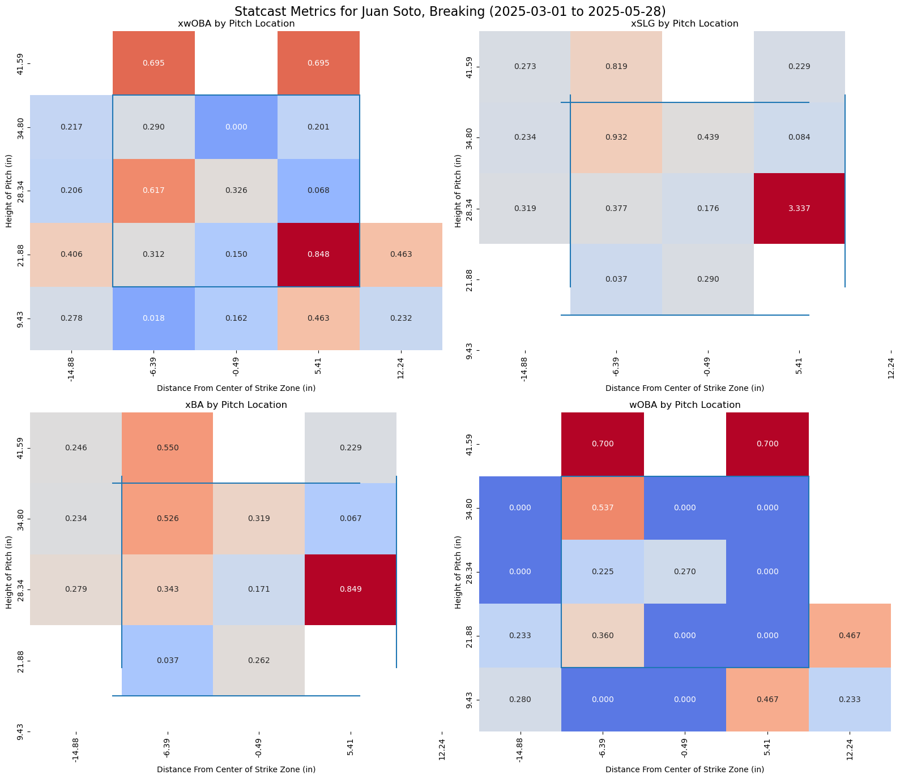
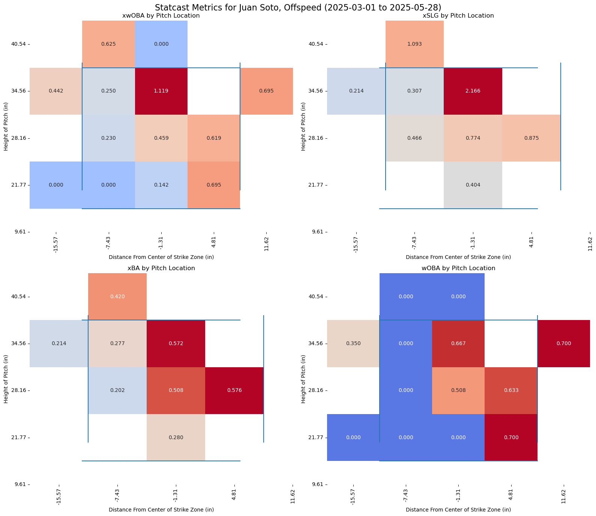
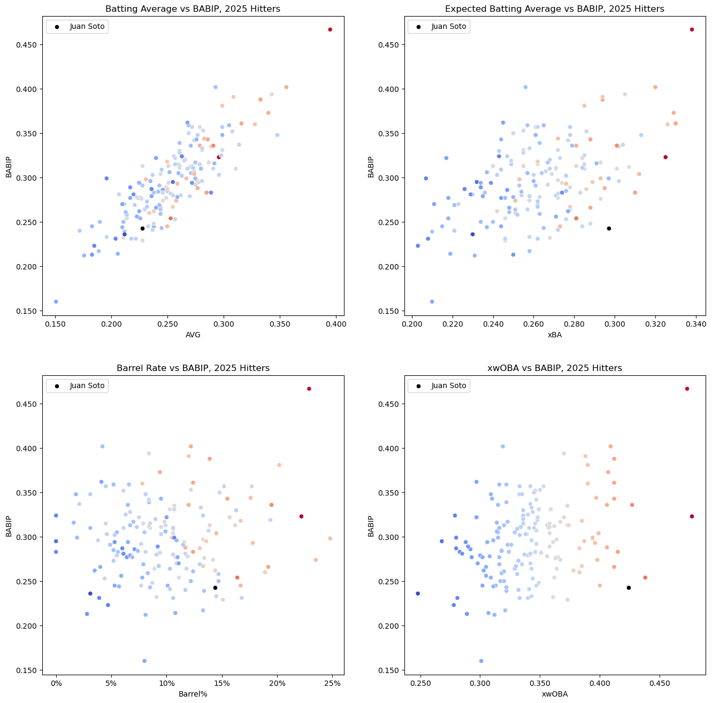

# Juan Soto Won't Keep This Up

*All stats as of games played 5/27/2025*
*To view the code used for this report visit this [notebook](soto_25.ipynb)

Much has been made of Juan Soto's slow start, and opinions are flying.  Yankees fans are pointing and laughing at the Mets, saying that he wished he'd stayed in the Bronx but they're glad he left.  I'd never begrude a Yankees fan the right to laugh at the Mets (or vice versa), but in a few months they might wish they'd picked a different chirp.  Here's a few explanations for what's up with Soto, and why it seems all but certain he'll heat up soon.

First, there's a few obvious ones we can point out, both with and without statistics.  If this ends up being the worst season of his career, as he's on pace for so far, he wouldn't be the first Hall of Famer to have a rough start with a new team.  He wouldn't even be the first Hall of Famer to do it with the Mets this decade; Francisco Lindor had a very uneven 2021 at the plate.  Additionally, he has played a lot of his games in a cold New York spring.  As for some basic stats, he's currently running a .243 BABIP.  That number includes a .197 BABIP in his last 24 games and a .214 BABIP against right-handed pitching, usually his stronger split.  No part of that is sustainable even for a bad hitter, or even a relatively slow one like Soto.  The league average BABIP in 2025 is .290.

## xwOBA vs wOBA

As of May 27, Soto is tied for the league lead in underperformance of his xwOBA, at about 90 points.  Last year the largest underperformance by a qualified hitter was 42 points.  Second place was 41 points, also by Juan Soto.  As the year progresses, these gaps will probably shrink.  I set out to plot xWOBA against real wOBA for all qualified 2025 hitters, and created a coinditional formatting rule to add color to the plot:

```python

df_2025['woba_diff_direction'] = np.sign(df_2025['est_woba_minus_woba_diff'])
direction_palette = {-1.0:'red', 0.0:'black', 1.0:'green' }
sns.scatterplot(
    data=df_2025, 
    x='est_woba', 
    y='woba', 
    hue='woba_diff_direction',
    palette=direction_palette, 
    legend=False
)
sns.scatterplot(data=df_2025[df_2025['last_name, first_name']=='Soto, Juan'], x='est_woba', y='woba', color='blue', label='Juan Soto')
sns.lineplot(data=df_2025, x='est_woba', y='est_woba', color='black')
plt.axvline(x=0.4, color='black', linestyle='--')
plt.title('xwOBA vs Actual wOBA for all hitters through May 27, 2025')
ax=plt.gca()
ax.xaxis.set_major_formatter(plt.FuncFormatter(lambda x, pos: f'{x:.3f}'))
ax.yaxis.set_major_formatter(plt.FuncFormatter(lambda x, pos: f'{x:.3f}'))
plt.xlabel('xwOBA')
plt.ylabel('wOBA')
```
Here are the results of this code:



### Insights

1.  By my own very unscientific definition, I defined an 'elite' hitter as one with an xwOBA above .400, and added a dotted line to the plot to denote this.  This is where Soto's underperformance looks more unique.  While some people fall nearly as far below the trend line as he does, none is nearly as good a hitter as he is.

2.  The league seems to be underperforming so far this year, there are more red dots than green ones.  This may be as simple as 'it's been cold outside,' and that's a more likely explanation than a calibration problem in the xwOBA metric.

## Soto Year-to-Year

Especially after seeing Soto so high in underperformance last year, I wanted to plot his differentials by year to look for a pattern.  I put together a dataframe of his seasons using this code:
```python
dfs=[]
for i in range(2018, 2026):
    dfs.append(pb.statcast_batter_expected_stats(i))
for i in range(8):
    dfs[i]=dfs[i][dfs[i]['last_name, first_name']=='Soto, Juan']
soto_stats = pd.concat(dfs)
```
Then, I made two plots using this code:

```python
fig, ax = plt.subplots(1, 2, figsize=(16, 8))
sns.scatterplot(data=soto_stats,
                x='est_woba',
                y='woba',
                hue=np.sign(soto_stats['est_woba_minus_woba_diff']),
                palette=direction_palette, 
                ax=ax[0], 
                legend=False)
sns.lineplot(data=soto_stats, 
             x='est_woba',
             y='est_woba', 
             color='black',
             ls='--', 
             ax=ax[0])
ax[0].xaxis.set_major_formatter(plt.FuncFormatter(lambda x, pos: f'{x:.3f}'))
ax[0].yaxis.set_major_formatter(plt.FuncFormatter(lambda x, pos: f'{x:.3f}'))
ax[0].set_title('Juan Soto xwOBA vs WOBA, by Season')
ax[0].set_xlabel('xwOBA')
ax[0].set_ylabel('wOBA')

sns.scatterplot(data=soto_stats, 
                x='year', 
                y='est_woba_minus_woba_diff', 
                ax=ax[1], 
                hue=np.sign(soto_stats['est_woba_minus_woba_diff']), 
                palette=direction_palette)
ax[1].axhline(y=0, color='black', ls='--')
ax[1].yaxis.set_major_formatter(plt.FuncFormatter(lambda x, pos: f'{x:.3f}'))
ax[1].set_ylabel('xwOBA-wOBA')
ax[1].set_xlabel('Season')
ax[1].set_title('Juan Soto Year-to-Year xWOBA-wOBA')
```

These were the results:



### Insights

1.  Soto is a chronic underperformer of expected stats, so whatever biases the model may have are not in his favor.  He overperformed by 20 points as a rookie and by a small amount in the COVID season.

2.  That said, this season would still be a clear outlier if it continued.

3.  I have a hypothesis about xWOBA and similar quality of contact stats, and why the league is underperforming them as a whole this year:  The coefficients used may have been more accurate for the 'juiced' balls of 2017-19, and are less applicible today.  The actual formula is propietary, so this is hard to verify.

## Statcast heatmaps

Running my Statcast heatmap function for Soto's entire season gives the following result:


This shows that he's particularly underperforming against middle-middle and middle-in pitches.  We can break this down a few more ways:

### By Pitcher Handedness





### By Pitch Type







### Insights

1.  Against right-handed pitching, Soto is particularly underperforming, especially against low-and-in pitching.  For his career, Soto has a .983 OPS against righties, and he's down at .729 this year.

2.  It's not clear how many breaking balls or offspeed pitches he's actually seen in each zone, but he's gotten unlucky on both of them too.  According to Baseball Savant, he's seen 162 offspeec pitches this year and has a .318 wOBA against his .452 xwOBA.  He's also 100 points below expected against the 315 breaking balls he's seen.

## BABIP 

As I discussed in the intro, Soto's BABIP has been unreasonably low and seems certain to trend up as the sample size grows.  These are plots of his BABIP vs batting average, expected batting average, barrel rate, and xwOBA.  I used this code to generate the plots:
```python
fig, ax=plt.subplots(2, 2, figsize=(16, 16))

sns.scatterplot(data=fg_25, 
                x='AVG',
                y='BABIP',
                hue='xwOBA', 
                palette= 'coolwarm', 
                legend=False, 
                ax=ax[0,0]
                )
sns.scatterplot(data=fg_25[fg_25['Name']=='Juan Soto'], 
                x='AVG',
                y='BABIP',
                color='black',
                label='Juan Soto',
                ax=ax[0,0]
                )

ax[0,0].xaxis.set_major_formatter(plt.FuncFormatter(lambda x, pos: f'{x:.3f}'))
ax[0,0].yaxis.set_major_formatter(plt.FuncFormatter(lambda x, pos: f'{x:.3f}'))

sns.scatterplot(data=fg_25, 
                x='xBA',
                y='BABIP',
                hue='xwOBA', 
                palette= 'coolwarm', 
                legend=False, 
                ax=ax[0,1]
                )
sns.scatterplot(data=fg_25[fg_25['Name']=='Juan Soto'], 
                x='xBA',
                y='BABIP',
                color='black',
                label='Juan Soto',
                ax=ax[0,1]
                )

ax[0,1].xaxis.set_major_formatter(plt.FuncFormatter(lambda x, pos: f'{x:.3f}'))
ax[0,1].yaxis.set_major_formatter(plt.FuncFormatter(lambda x, pos: f'{x:.3f}'))

sns.scatterplot(data=fg_25, 
                x='xwOBA',
                y='BABIP',
                hue='xwOBA', 
                palette= 'coolwarm', 
                legend=False, 
                ax=ax[1,1]
                )
sns.scatterplot(data=fg_25[fg_25['Name']=='Juan Soto'], 
                x='xwOBA',
                y='BABIP',
                color='black',
                label='Juan Soto',
                ax=ax[1,1]
                )

ax[1,1].xaxis.set_major_formatter(plt.FuncFormatter(lambda x, pos: f'{x:.3f}'))
ax[1,1].yaxis.set_major_formatter(plt.FuncFormatter(lambda x, pos: f'{x:.3f}'))

sns.scatterplot(data=fg_25, 
                x='Barrel%',
                y='BABIP',
                hue='xwOBA', 
                palette= 'coolwarm', 
                legend=False, 
                ax=ax[1,0]
                )
sns.scatterplot(data=fg_25[fg_25['Name']=='Juan Soto'], 
                x='Barrel%',
                y='BABIP',
                color='black',
                label='Juan Soto',
                ax=ax[1,0]
                )

ax[1,0].xaxis.set_major_formatter(plt.FuncFormatter(lambda x, pos: f'{int(100*x)}%'))
ax[1,0].yaxis.set_major_formatter(plt.FuncFormatter(lambda x, pos: f'{x:.3f}'))

ax[0,0].set_title('Batting Average vs BABIP, 2025 Hitters')
ax[0,1].set_title('Expected Batting Average vs BABIP, 2025 Hitters')
ax[1,0].set_title('Barrel Rate vs BABIP, 2025 Hitters')
ax[1,1].set_title('xwOBA vs BABIP, 2025 Hitters')
```
These are the results.  The plots are color-coded by xwOBA, but Soto is highlighted separately.



### Insights

1.  Soto's actual batting average is low, as you'd expect with his BABIP of .243.  Batting average of course isn't a very useful stat by itself, but it is useful to see most of the players near him have low xwOBAs.  Soto clearly doesn't belong on that part of the plot.

2.  His xBA is too high for that BABIP as well.  These plots together suggest Soto is hitting a lot of fly balls that hang up for outfielders.  But this doesn't seem to be the case, his fly ball rate is lower than it was last year.  His 'pull air' rating on Statcast is low, but it basically always is outside of last year, when he got to hit into the short porch of Yankee Stadium and probably changed his swing for it.

3.  Barrel rate probably isn't very sticky at this point in the season, but Soto is having the second best full-season barrel rate of his career so far.

4.  There doesn't seem to be a strong correlation between xwOBA and BABIP at this point of the season.  

5.  While this report is about Juan Soto, there were a few other notable dots on these plots.  The first is the blue dot on every plot running a .400 BABIP, which turned out to be Gavin Lux.  His walk rate is high, but his contact quality and speed aren't really indicative of this BABIP.  

6.  I didn't label Aaron Judge, but he's having a great season.  I don't even know if a .467 BABIP is extreme given his contact quality and 22.9% barrel rate.  But it probably is; even in his .406 season Ted Williams had a .378 BABIP

For a few other insights, Soto's run value versus pitches Statcast lists in the heart of the zone is -7.  His plate discipline is still elite, but he's been more patient than ever this year.  He has career lows in Z-Swing%, overall swing rate, and first-pitch swing rate.  He could maybe seek to be a bit more aggressive as he adjusts to playing with the Mets, but under the hood he's the same elite hitter he's always been.  The most likely outcome of this contract is still a Mets cap on his plaque in Cooperstown.