# Deriving Major League Baseball's 'Aging Curve'

## Introduction

Baseball players do not arrive to the big leagues as finished products.  Even after dominating at the highest levels of Minor League Baseball, it is normal to see even the best players struggle at first.  Over time, with more experience against MLB players, they'll improve until they reach their peak.  Later on, once they begin to age, they decline until they are no longer able to play anymore and retire.  This is something that most baseball fans understand intuitively.  But can it be mathematically modeled?  We'll attempt to use regression techniques to model the relationship between player age and production.  In the end, we can plot this relationship, and learn something interesting about the nature of projection systems. 

## Methods

We'll use several Python libraries to make this process easier.  NumPy and pandas are standard in any data analysis inside Python.  We'll also need the PyBaseball library to access the Fangraphs API, so we can pull baseball data all the way back to 1920 and the start of the live-ball era.  Models will be fit through the statsmodels library.

## Steps

### 1.  Pull and clean data

By a few lengthy API calls, we can pull data for all players with at least 200 at-bats in a season back to 1920.  

``` Python

batters_1 = pb.batting_stats(start_season = 1920, end_season = 1980 ,league = 'AL', qual=200)
batters_2 = pb.batting_stats(start_season = 1980, end_season = 2024 ,league = 'AL', qual=200)
batters_3 = pb.batting_stats(start_season = 1920, end_season = 1980 ,league = 'NL', qual=200)
batters_4 = pb.batting_stats(start_season = 1980, end_season = 2024 ,league = 'NL', qual=200)

batters_df = pd.concat([batters_1, batters_2, batters_3, batters_4])
batters_df = batters_df.drop_duplicates()
```

### 2.  Include 2025 Data

I chose to extrapolate this data to project the rest of the season.  This probably isn't the most statistically sound way to handle this, but the dataset is so large it may not be too impactful anyway.  I could have also scaled WAR figures for seasons like 1981, 1994-95, and 2020, but did not do so.  Of course you could fit this curve without including 2025 at all, but I plan to use this model for a future projection project.
We can then trim all nonessential columns and save to .csv, to avoid needing to import manually again

```python

all_batters = pd.concat([batters_df, batters_2025_trimmed])

all_batters.to_csv('all_batters.csv')

```


### 3.  Begin modeling

## Simple Linear Model

As a baseline, we can fit the simplest possible linear model for our data:  
$ WAR = a*Age + b$ 

```python 
from statsmodels.formula.api import ols

simple_linear = ols('WAR~Age', data=all_batters).fit()
```

This and some matplotlib code produces the following plot

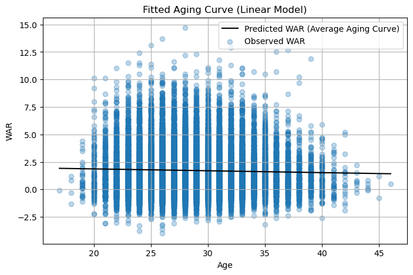

This is not a valid model and we don't expect it to be.  The intuitive relationship between WAR and age I described in the introduction is not linear.  But for fun, here are the residual plot and normality assessment:

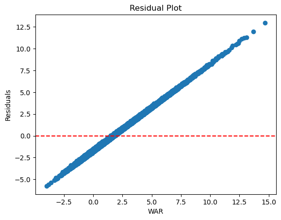


## Quadratic Model

The relationship between WAR and age intuitively seems quadratic - players improve until they reach their peak, and then decline as they get old.  We can add an $Age^2$ term to the model to account for this.

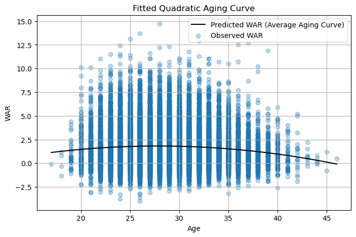

This model might more accurately describe the shape of the data, but there is a problem.  We are not accounting for the differences between individual players.  Therefore, we don't see much improvement in our diagnostic plots.

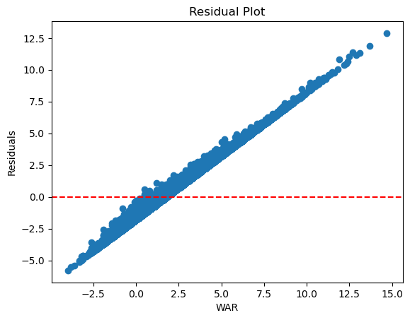
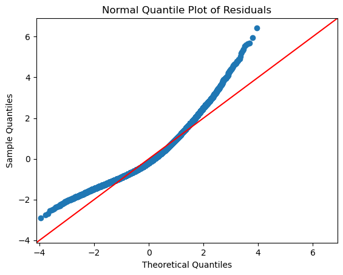

## Fixed Player Effects Model

We can try to account for differences in player talent with a fixed effects model, creating dummy variables for every player (except one).  This also means we'll have to drop the data of all players with fewer than 3 seasons, as trying to keep all players in this model causes the regression matrix to not converge.

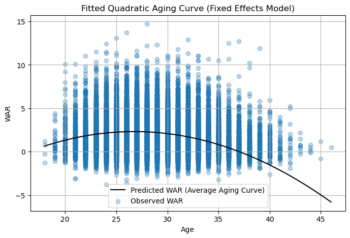

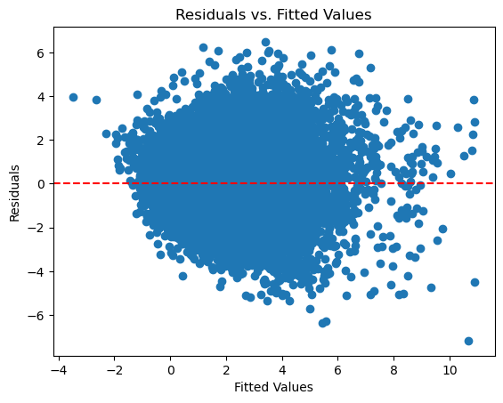
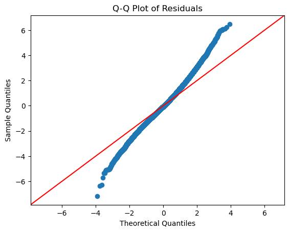

Now our residuals look more randomly scattered, but their distribution is not normal.  We can add all players back into the model by switching to a mixed model with random effects for each player.

## Mixed Effects Model

```python

batter_mixed = mixedlm("WAR ~ Age + Age2", data=all_batters, groups=all_batters["IDfg"]).fit(reml=False)
intercept = batter_mixed.params['Intercept']
coef_age = batter_mixed.params['Age']
coef_age2 = batter_mixed.params['Age2']
age_range = np.linspace(batters_df['Age'].min(), batters_df['Age'].max(), 100)
predicted_war = intercept + coef_age * age_range + coef_age2 * (age_range ** 2)
plt.figure(figsize=(8,5))
plt.plot(age_range, predicted_war, label='Predicted WAR (Average Aging Curve)', color='black')
plt.scatter(batters_df['Age'], batters_df['WAR'], alpha=0.3, label='Observed WAR')
plt.xlabel('Age')
plt.ylabel('WAR')
plt.title('Fitted Quadratic Aging Curve (Mixed Effects Model)')
plt.legend()
plt.grid(True)
plt.show()

```

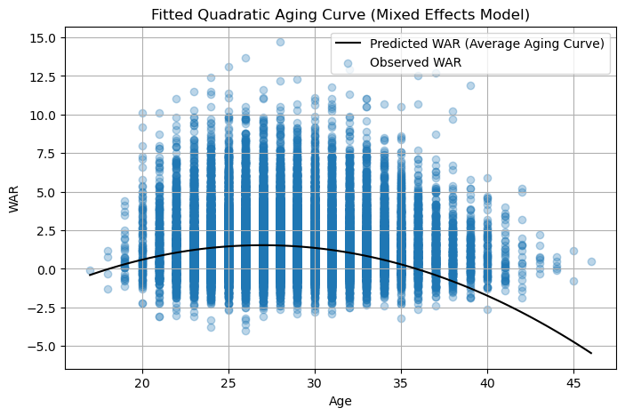

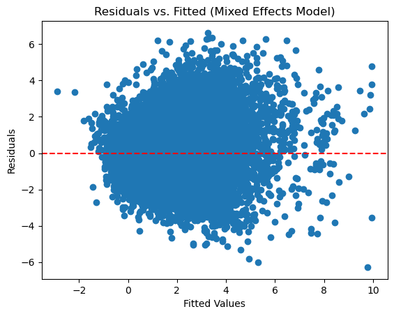
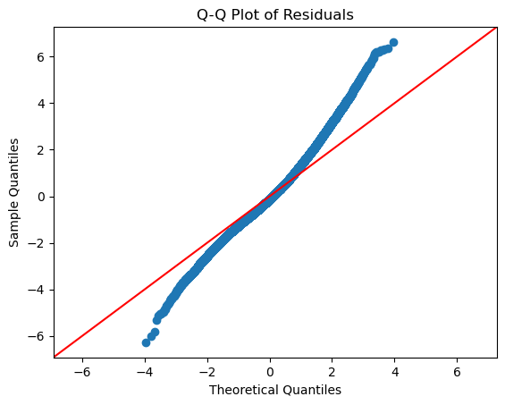

This model does seem to be less in violation of assumptions, but does not perform any better.  It produces a better BIC, but worse AIC.  Looking at this residual plot tells us something about WAR as a whole, however:  It is very difficult to model in the extremes,  The underfitting is greatly magnified as WAR increases.  We can look at WAR's distribution as well:

```python
sns.histplot(all_batters['WAR'], kde=True)
plt.title('Histogram of WAR')
plt.xlabel('WAR')
plt.ylabel('Frequency')
plt.show()
```
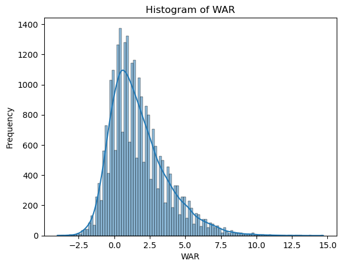
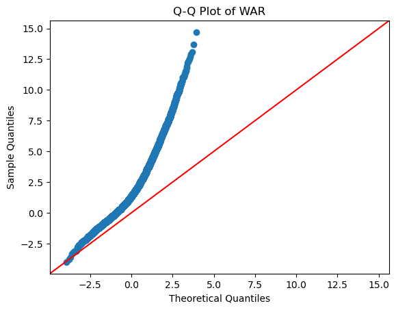

WAR, by its nature, is not normally distributed.  If it were, deviations from the mean of 1.7 would be just as likely to be positive as negative.  But WAR is a cumulative metric, and therefore rewards quantity.  If a player produces negative WAR over a long enough time, that player will stop getting opportunities to produce any more.  Because of this, the distribution of WAR will always be skewed.  We can try to account for this by transforming the response variable in a few ways.


## Box-Cox Mixed Effects Model
First, we can apply a Box-Cox transformation to WAR:

```python
from scipy.stats import boxcox

shift = abs(all_batters['WAR'].min()) + 1
war_shifted = all_batters['WAR'] + shift

all_batters['WAR_boxcox'], lam = boxcox(war_shifted)
print(f'Optimal lambda for Box-Cox: {lam:.3f}')
```
This gives us a lambda of -0.137

```python
from statsmodels.regression.mixed_linear_model import MixedLM
batter_mixed_boxcox = MixedLM.from_formula(
    "WAR_boxcox ~ Age + Age2",
    groups=all_batters["IDfg"],
    data=all_batters
).fit(reml=False)
from scipy.special import inv_boxcox

intercept = batter_mixed_boxcox.params['Intercept']
coef_age = batter_mixed_boxcox.params['Age']
coef_age2 = batter_mixed_boxcox.params['Age2']
predicted_transformed_war = intercept + coef_age * age_range + coef_age2 * (age_range ** 2)
age_range = np.linspace(all_batters['Age'].min(), all_batters['Age'].max(), 100)
predicted_war = intercept + coef_age * age_range + coef_age2 * (age_range ** 2)
predicted_war_original = inv_boxcox(predicted_transformed_war, lam) - shift

plt.figure(figsize=(8,5))
plt.plot(age_range, predicted_war_original, label='Predicted WAR (Back-transformed)', color='black')
plt.scatter(all_batters['Age'], all_batters['WAR'], alpha=0.3, label='Observed WAR')
plt.xlabel('Age')
plt.ylabel('WAR')
plt.title('Box-Cox Fitted Quadratic Aging Curve (Mixed Effects Model, Original Scale)')
plt.legend()
plt.grid(True)
plt.show()
```

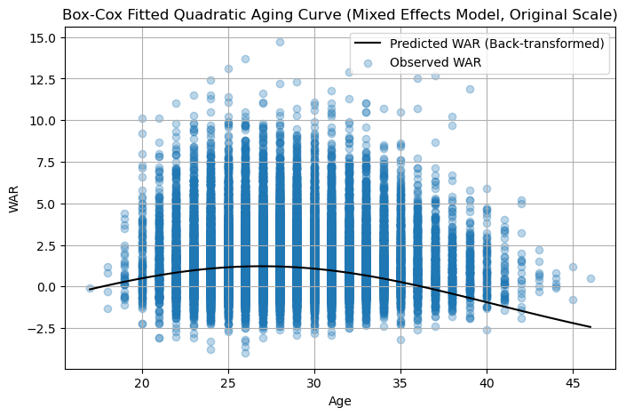

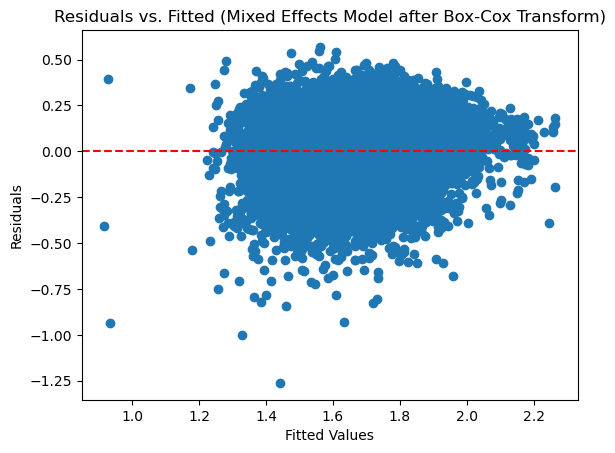

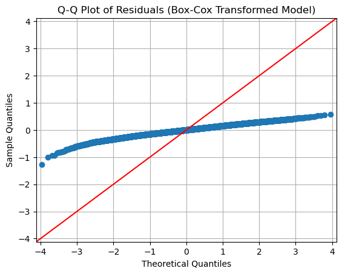

We can do a similar log transform model

## Log Mixed Effects Model
```python
shift = abs(all_batters['WAR'].min()) + 1  
all_batters['WAR_log'] = np.log(all_batters['WAR'] + shift)

model_log = MixedLM.from_formula(
    "WAR_log ~ Age + Age2",
    groups=all_batters["IDfg"],
    data=all_batters
).fit(reml=False)
age_range = np.linspace(all_batters['Age'].min(), all_batters['Age'].max(), 100)
age_df = pd.DataFrame({
    'Age': age_range,
    'Age2': age_range**2
})

predict_log_war = model_log.predict(exog=age_df)

predicted_war = np.exp(predict_log_war) - shift

plt.figure(figsize=(8, 5))
plt.plot(age_range, predicted_war, label='Predicted WAR (back-transformed)', color='black')
plt.scatter(all_batters['Age'], all_batters['WAR'], alpha=0.3, label='Observed WAR')
plt.xlabel('Age')
plt.ylabel('WAR')
plt.title('Aging Curve (Log-Transformed Mixed Effects Model)')
plt.legend()
plt.grid(True)
plt.show()
```
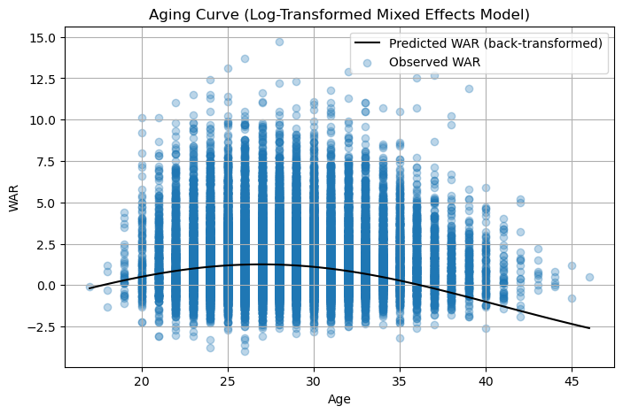

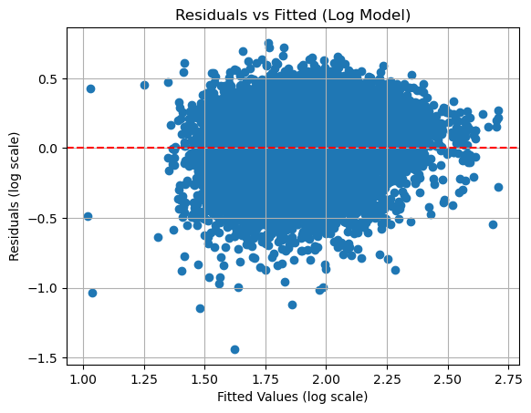

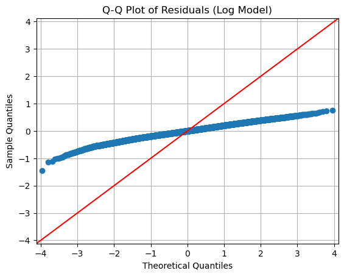

These models both have significant issues with normality of their residuals, but do perform much better overall.

```python
print([batter_mixed.aic, batter_mixed.bic])
print([batter_fixedeffects.aic,batter_fixedeffects.bic])
print([batter_mixed_boxcox.aic,batter_mixed_boxcox.bic])
print([model_log.aic, model_log.bic])

[np.float64(103258.4527664702), np.float64(103299.39854195615)]
[np.float64(87203.65305390552), np.float64(108873.33824298676)]
[np.float64(-12725.594132177008), np.float64(-12684.648356691065)]
[np.float64(744.556770761963), np.float64(785.5025462479065)]
```
The best model here, as was somewhat expected, is the Box-Cox transformed model.  We can re-fit this without using REML, to make it more suited for predictive modeling.

```python
final_model = MixedLM.from_formula(
    "WAR_boxcox ~ Age + Age2",
    groups=all_batters["IDfg"],
    data=all_batters
).fit(reml=True)
```

We'll also re-fit the mixed model because it is easier to interpret:

```python
final_mixed = mixedlm("WAR ~ Age + Age2", data=all_batters, groups=all_batters["IDfg"]).fit(reml=True)
```
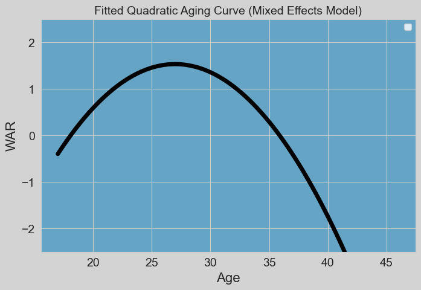

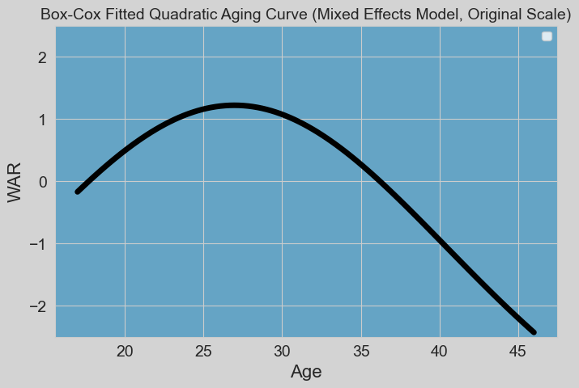

We can use the Box-Cox model to plot the expected change in WAR year-to-year, at the population level

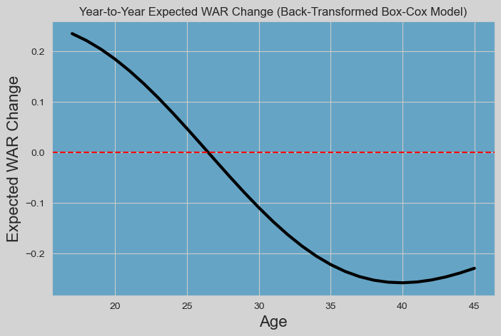